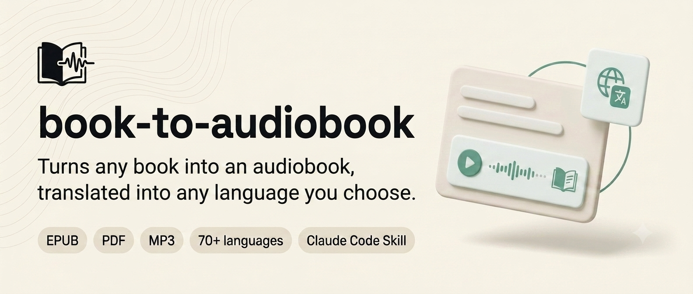

# book-to-audiobook

<p align="center">
  
</p>

<p align="center">
  
  
  
  
  
</p>

<p align="center">
  Turn any epub / pdf / txt into a narrated audiobook or chapter-based MP3 collection —<br>
  100% free, no API key.
</p>

> [!NOTE]
> **Fork Attribution & Credit**  
> This project is a fork of [`gomesfellipe/book-to-audiobook`](https://github.com/gomesfellipe/book-to-audiobook) by [Fellipe Gomes](https://github.com/gomesfellipe).  
> This enhanced edition adds chapter-based batch audio conversion for web novels/epubs, automatic `progress.json` resume capability, interactive GUIs, and a dedicated swimming MP3 player file copying tool.

<p align="center">
  <a href="#quick-start">Quick start</a> ·
  <a href="#how-it-works">How it works</a> ·
  <a href="#chapter-batch-generation--swimming-mp3-copier">Chapter Batch & Copier</a> ·
  <a href="#cli-usage-without-the-assistant">CLI usage</a> ·
  <a href="#structure">Structure</a> ·
  <a href="#contributing--development">Contributing</a>
</p>

---

Uses [`edge-tts`](https://github.com/rany2/edge-tts) (Microsoft's free Neural
voices) for speech synthesis and
[`deep-translator`](https://github.com/nidhaloff/deep-translator)'s
`GoogleTranslator` for optional translation — both free, but require
internet.

## Why

- 🆓 **100% free, no API key** — no OpenAI/ElevenLabs/Polly bill, ever.
- 🌍 **Any source/target language** — translation is optional; hundreds of
  real Neural voices to pick from (including Chinese, English, Spanish, etc.).
- 📖 **Chapter-by-Chapter Batch Processing** — specify start chapter & count (e.g. Chapter 10, 100 chapters) and output one MP3 file per chapter named strictly by chapter number.
- 🔄 **Automatic Resume (`progress.json`)** — network drops or system restarts automatically resume from where synthesis left off.
- 🏊 **Swimming MP3 Player Copier** — companion tool auto-detects external drives and copies MP3s in exact sequential numerical order so players read them correctly.
- 🖥️ **Graphical User Interfaces** — launch standalone Tkinter GUIs for both generator and copier tools.
- 📚 **epub / pdf / txt supported.**

## How it works

Ask Claude Code (opened at the root of this repo) to turn a book into an
audiobook, or use the interactive GUIs and CLI tools:

0. **Setup** — checks Python/ffmpeg dependencies.
1. **Book & preferences** — pick the book, source/target language, voice, speed.
2. **Inspect & Chapter Selection** — select whole-book conversion or chapter range.
3. **Convert & Resume** — synthesizes audio chapters, saving progress to `progress.json`.
4. **Copy to Device** — transfer generated MP3s in strict natural numerical order to your swimming MP3 player.

---

## Chapter Batch Generation & Swimming MP3 Copier

### 1. Chapter Batch Generator GUI

Launch the desktop interface to batch convert chapters with start chapter and count selection:

```bash
python -m src.cli gui-generator
```

Or via CLI:

```bash
python -m src.cli chapter-convert books/private/my-novel.epub \
  --output-dir ./output_chapters \
  --start-chapter 1 \
  --chapter-count 100 \
  --voice zh-CN-YunjianNeural
```

**Preview voices and speeds:** open [`docs/voice-preview.html`](docs/voice-preview.html) in a browser (or click **▶ 试听所有声音和语速** in the GUI) to play every voice × rate the GUI offers. Regenerate it after changing `VOICES`/`RATES` in `src/gui_generator.py`:

```bash
python scripts/build_voice_preview.py
```

Each chapter is generated into a pure numeric file (e.g. `0001.mp3`, `0002.mp3`). Progress is automatically tracked in `./output_chapters/progress.json`. Interrupting and re-running will resume from uncompleted chapters.

### 2. Swimming MP3 Player Copier GUI

Swimming MP3 players usually play audio files in the order they were written to the FAT filesystem. Launch the copier GUI to auto-detect your MP3 player drive and copy files in natural numerical order:

```bash
python -m src.cli gui-copier
```

Or via CLI:

```bash
python -m src.cli copy-to-device \
  --source-dir ./output_chapters \
  --target-dir /Volumes/SWIM_MP3/Audiobooks
```

---

## Quick start

1. Clone this repository.
2. Open terminal at the root of the cloned folder.
3. Install dependencies: `pip install -r requirements.txt`
4. Drop your book into `books/private/` (never versioned).
5. Run `python -m src.cli gui-generator` or `python -m src.cli chapter-convert ...` to generate audiobooks.

No book on hand? `books/alice.epub` ships in the repo (*Alice's Adventures in Wonderland*, public domain).

## Requirements

- Python 3.10+ (or 3.9+)
- [`ffmpeg`](https://ffmpeg.org/) installed on the system (`brew install ffmpeg` on macOS, `apt install ffmpeg` on Linux).
- Internet access (for Microsoft Edge Neural TTS voices).

```bash
pip install -r requirements.txt
```

To run tests:

```bash
pip install -r requirements-dev.txt
pytest
```

## CLI usage (without the assistant)

```bash
# Check dependencies
python -m src.cli doctor

# Launch Batch Generator GUI
python -m src.cli gui-generator

# Launch Swimming MP3 Copier GUI
python -m src.cli gui-copier

# Batch convert chapters via CLI
python -m src.cli chapter-convert books/private/my-novel.epub \
  --output-dir ./my_output \
  --start-chapter 10 \
  --chapter-count 100 \
  --voice zh-CN-YunjianNeural

# Copy files sequentially to swimming MP3 player
python -m src.cli copy-to-device \
  --source-dir ./my_output \
  --target-dir /Volumes/MP3_PLAYER
```

## Structure

```text
src/
  loaders/          epub, pdf, txt -> text
  chapter_loader.py  extracts discrete chapters from EPUB/TXT
  chapter_pipeline.py batch chapter synthesis with progress.json resume logic
  copier.py          external drive auto-detection & sequential natural sorting copy
  gui_generator.py   Tkinter GUI for chapter batch generation
  gui_copier.py      Tkinter GUI for swimming MP3 player file copier
  text_cache.py      cache of extracted/translated text
  cleaning.py         strips decorative lines, normalizes roman numerals
  boundary.py           start/end candidates for the real content
  metadata.py             title/author/subtitle
  intro.py                  spoken opening text
  pronunciation.py           flags pronunciation-risky snippets
  translate.py                 batched translation
  text_to_speech.py              text -> mp3 (edge-tts), voice catalog lookup
  tools.py                         split text / combine mp3s
  pipeline.py                        orchestrates whole-book single-file conversion
  cli.py                               command-line entry point
books/alice.epub          demo fixture (public domain)
```

## Contributing / development

See [`CLAUDE.md`](CLAUDE.md) for architecture overview and test running commands.

## License

[MIT](LICENSE)

---

<p align="center">
  Original work by <a href="https://github.com/gomesfellipe">Fellipe Gomes</a> (<a href="https://github.com/gomesfellipe/book-to-audiobook">gomesfellipe/book-to-audiobook</a>)
</p>

